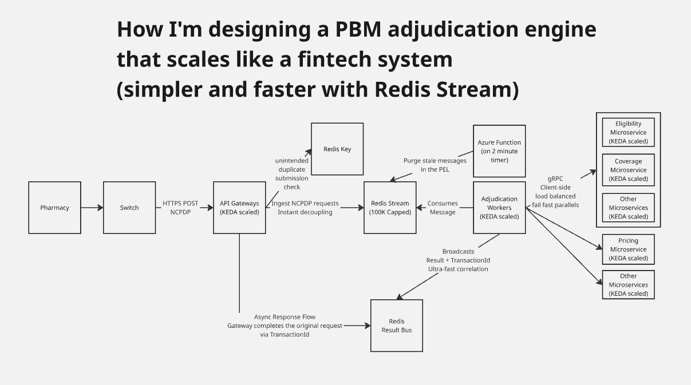

Architecture diagram for the PBM adjudication engine, here is a summary of the system flow and key components:

- Ingestion and Decoupling: NCPDP requests are sent from a Pharmacy via a Switch and HTTPS POST to KEDA-scaled API Gateways, which ingest the requests and immediately decouple them from the processing logic.
- Message Streaming: The system uses a Redis Stream (capped at 100K messages) to handle incoming NCPDP requests, ensuring high-speed ingestion and a buffer for downstream processing.
- Maintenance and Reliability: An Azure Function runs on a 2-minute timer to purge stale messages in the Pending Entitlement List (PEL) to maintain stream health.
- Adjudication Workers: KEDA-scaled Adjudication Workers consume messages from the Redis Stream and coordinate the core processing logic.
- Microservices Integration: The Workers interact with various KEDA-scaled microservices—including Eligibility, Coverage, and Pricing—using gRPC client-side load balancing with a "fail fast parallel" approach.
- Distributed Coordination: The system implements a Distributed Lock (with a 2-second TTL) via Redis Keys to prevent duplicate transaction processing.
- Async Response Flow: Results are broadcasted to a Redis Result Bus along with a TransactionId for ultra-fast correlation, allowing the API Gateway to complete the original asynchronous request.
